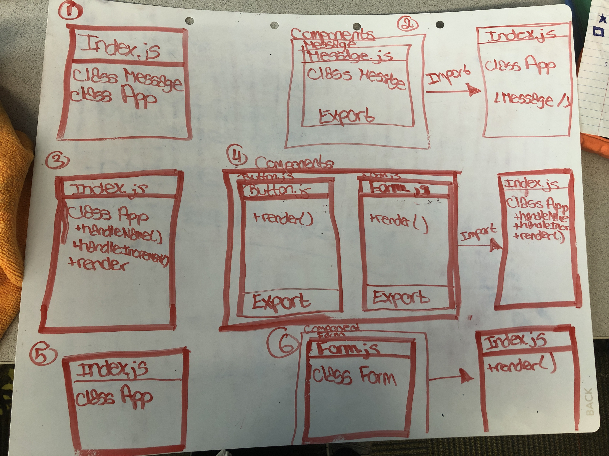

# LAB - 28

## Props and State

### Author: Tia Rose

## Part 1 links
* [Pre-Refactor](https://codesandbox.io/s/28-starter-code-props-g9mwd?fontsize=14) 

* [Refactor](https://codesandbox.io/s/28-starter-code-props-refactor-u24s8?fontsize=14) 

## Part 2 links
* [Pre-Refactor](https://codesandbox.io/s/28-starter-code-internal-state-ehpq1?fontsize=14) 

* [Refactor](https://codesandbox.io/s/28-starter-code-internal-state-refactor-gw3jx?fontsize=14) 

## Part 3 links
* [Pre-Refactor](https://codesandbox.io/s/28-starter-code-external-state-gxvep?fontsize=14) 

* [Refactor](https://codesandbox.io/s/28-starter-code-external-state-4bnro?fontsize=14) 

